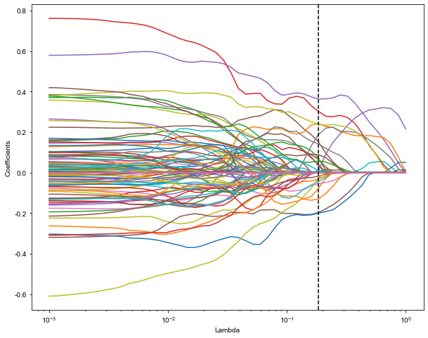
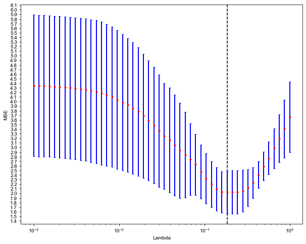
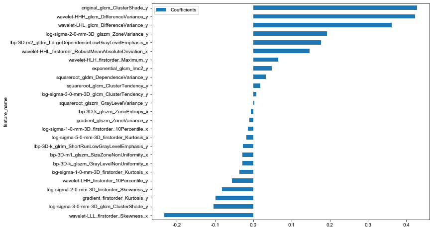
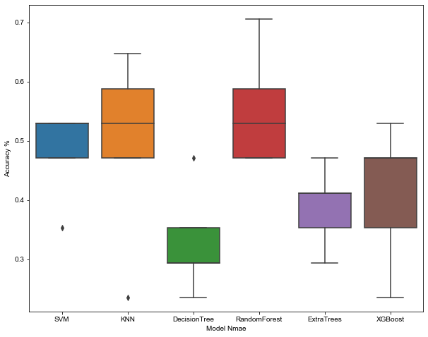
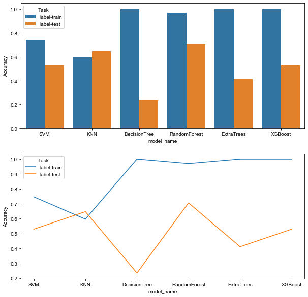
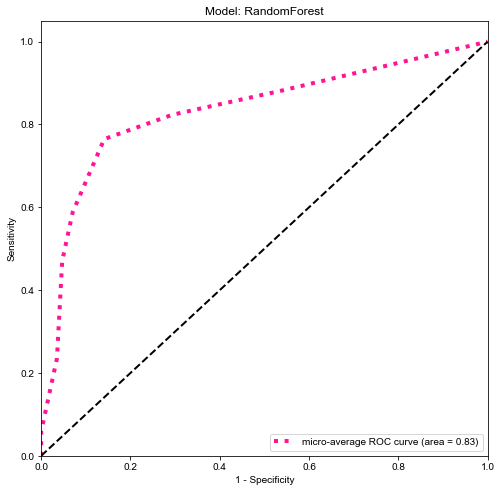
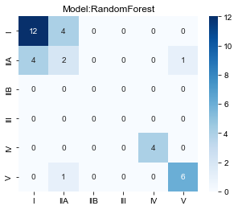

## Method

1. 对影像（nii或者nii.gz）数据，使用pyradiomics进行特征提取，得到$rad\_feature$。
   1. 这里使用到的特征提取配置文件为`exampleCT.yaml`。
   2. 红色和蓝色ROI区域，每个区域提取到1906维特征。
   2. 将两组特征进行前融合技术，共获取到3812维特征。
2. 对这些特征进行正则化（Z-score），将数据变化到服从 N~(0, 1)。
   1. 计算每列特征的均值mean、方差std
   2. $feature=\frac{feature-mean}{std}$，转化到0均值，1方差。
3. 对提取的组学特征$rad\_feature$，使用`spearman`相关系数，计算特征之间的相关性。
4. 对于相关系数大于0.9的特征，两者保留其一，得到$rad\_sel\_feature$。
5. 使用Lasso对数据进行交叉验证，筛选最好的惩罚系数$\lambda$。
   1. 筛选出系数不为0的特征，对$rad\_sel\_feature$进行进一步降维得到$rad\_final$。
   2. 系数不为0的特征，组合成$rad\_score$公式。
6. 对数据进行随机划分，可以采用2中模式。
   1. 完全随机划分，多次尝试，保留最好的一次划分。
   2. N fold交叉验证，保留最好的一个。
7. 使用多种机器学习算法模型（`LR`、`SVM`、`DT`、`RF`、`ExtraTree`、`XGBoos`等）对$rad\_final_{train}$进行训练。
8. 在$rad\_final_{val}$上进行不同算法模型验证。得到常见指标验证以及结果可视化。
   1. 准确率
   2. AUC
   4. ROC曲线，混淆矩阵
9. 模型过程、结果可视化，特征的相关系数矩阵、Lasso交叉验证、能效图、特征权重图、交叉验证结果箱型图、模型结果对比曲线、绘制ROC曲线，混淆矩阵等。


### 具体数据

#### 样本分布

```
label的分布，{'I': 0, "IIA": 1, "IIB": 2, 'III':3, 'IV':4, 'V':5}
0        36
1        17
5        15
4        10
3         4
2         2
```

#### 筛选后特征（节选）

其中`_x`结尾的特征是红色区域（label=1）特征，`_y`结尾的特征是红色区域（label=3）特征，

```
[ 'squareroot_glszm_LargeAreaHighGrayLevelEmphasis_x',
 'squareroot_glszm_LargeAreaLowGrayLevelEmphasis_x',
 'squareroot_glszm_LowGrayLevelZoneEmphasis_x',
 'squareroot_glszm_SizeZoneNonUniformity_x',
 'squareroot_glszm_SizeZoneNonUniformityNormalized_x',
 'squareroot_glszm_SmallAreaHighGrayLevelEmphasis_x',
 'wavelet-HHH_firstorder_Median_x',
 'wavelet-HHH_firstorder_Skewness_x',
 'wavelet-HHH_glcm_ClusterShade_x',
 'wavelet-HHH_glcm_Correlation_x',
 'wavelet-HHH_glcm_Idn_x',
 'wavelet-HHH_glcm_InverseVariance_x',
 'wavelet-HHH_glszm_GrayLevelVariance_x',
 'wavelet-HHH_glszm_SmallAreaHighGrayLevelEmphasis_x',
 'wavelet-LLL_glszm_ZoneVariance_x',
 ...
 'exponential_glcm_Correlation_y',
 'exponential_glcm_Idn_y',
 'exponential_glcm_Imc1_y',
 'exponential_glcm_Imc2_y',
 'exponential_glcm_InverseVariance_y',
 'exponential_glcm_MaximumProbability_y',
 'exponential_gldm_DependenceVariance_y',
 'exponential_glrlm_ShortRunEmphasis_y',
 'exponential_glrlm_ShortRunLowGrayLevelEmphasis_y',
 'exponential_glszm_GrayLevelNonUniformity_y',
 'exponential_glszm_GrayLevelNonUniformityNormalized_y',
 'exponential_glszm_LargeAreaHighGrayLevelEmphasis_y',
 'exponential_glszm_LowGrayLevelZoneEmphasis_y',
 'exponential_glszm_SizeZoneNonUniformityNormalized_y',
 'exponential_glszm_SmallAreaEmphasis_y',
 'exponential_glszm_SmallAreaLowGrayLevelEmphasis_y',
 'exponential_glszm_ZoneEntropy_y']
```

#### Lasso交叉验证

##### 不同$\lambda$下特征Coefficients



##### 不同$\lambda$下MSE



##### Rad_Score

```python
rad_score = = 1.658289426194363  -0.028254 * lbp-3D-k_glszm_GrayLevelNonUniformity_x -0.006853 * lbp-3D-k_glszm_ZoneEntropy_x -0.027834 * lbp-3D-m1_glszm_SizeZoneNonUniformity_x -0.014355 * log-sigma-1-0-mm-3D_firstorder_10Percentile_x -0.035593 * log-sigma-1-0-mm-3D_firstorder_Kurtosis_x -0.017413 * log-sigma-5-0-mm-3D_firstorder_Kurtosis_x +0.147511 * wavelet-HHL_firstorder_RobustMeanAbsoluteDeviation_x -0.232083 * wavelet-LLL_firstorder_Skewness_x +0.048137 * exponential_glcm_Imc2_y -0.099006 * gradient_firstorder_Kurtosis_y -0.010664 * gradient_glszm_ZoneVariance_y -0.026811 * lbp-3D-k_glrlm_ShortRunLowGrayLevelEmphasis_y +0.176508 * lbp-3D-m2_gldm_LargeDependenceLowGrayLevelEmphasis_y -0.081672 * log-sigma-2-0-mm-3D_firstorder_Skewness_y +0.192802 * log-sigma-2-0-mm-3D_glszm_ZoneVariance_y -0.104271 * log-sigma-3-0-mm-3D_glcm_ClusterShade_y +0.008422 * log-sigma-3-0-mm-3D_glcm_ClusterTendency_y +0.427757 * original_glcm_ClusterShade_y +0.018130 * squareroot_glcm_ClusterTendency_y +0.032539 * squareroot_gldm_DependenceVariance_y +0.003264 * squareroot_glszm_GrayLevelVariance_y +0.422477 * wavelet-HHH_glcm_DifferenceVariance_y +0.065863 * wavelet-HLH_firstorder_Maximum_y -0.056246 * wavelet-LHH_firstorder_10Percentile_y +0.361179 * wavelet-LHL_glcm_DifferenceVariance_y
```

##### 特征权重



#### 模型效果

##### 5折交叉验证，固定随机种子`random_state=0`



### 验证集

多分类，没有办法在数据拆分中计算auc值、95% CI、youden指数下的threshold等指标，目前仅以准确率作为测试集指标。

|      |   model_name | Accuracy |        Task |
| ---: | -----------: | -------: | ----------: |
|    0 |          SVM | 0.746269 | label-train |
|    1 |          SVM | 0.529412 |  label-test |
|    2 |          KNN | 0.597015 | label-train |
|    3 |          KNN | 0.647059 |  label-test |
|    4 | DecisionTree | 1.000000 | label-train |
|    5 | DecisionTree | 0.235294 |  label-test |
|    6 | RandomForest | 0.970149 | label-train |
|    7 | RandomForest | 0.705882 |  label-test |
|    8 |   ExtraTrees | 1.000000 | label-train |
|    9 |   ExtraTrees | 0.411765 |  label-test |
|   10 |      XGBoost | 1.000000 | label-train |
|   11 |      XGBoost | 0.529412 |  label-test |



#### 模型Micro-AUC

多分类AUC参考：https://www.zhihu.com/question/304639772

因为IIB、III在测试集中没有数据，造成分类别的以及macro auc无法计算。






#### 其他单个模型的AUC以及混淆矩阵参考assets里面的文件。